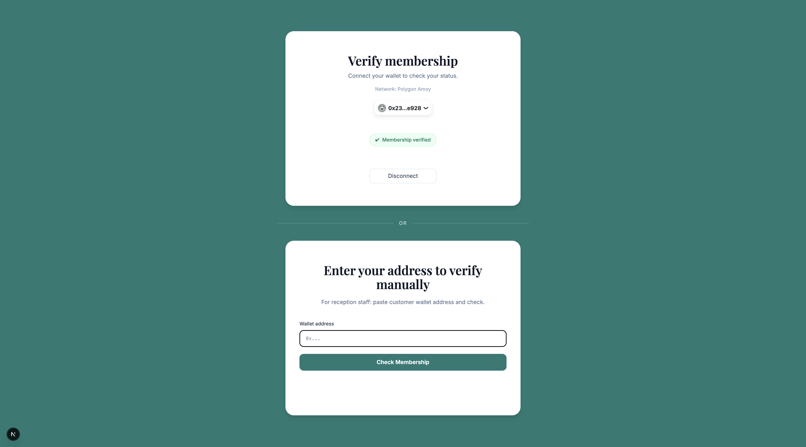
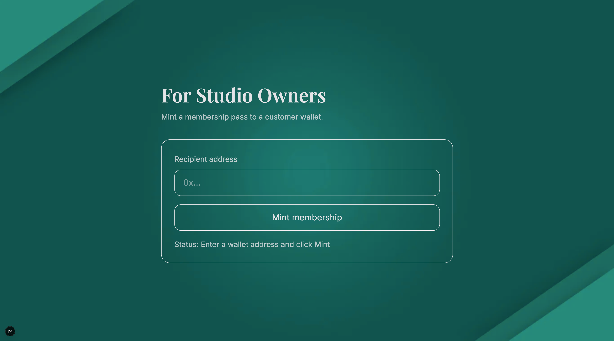

# FlowPass 

NFT-Based Membership Platform for Wellness Studios

FlowPass is a Web3 membership platform that demonstrates NFT-based access management for wellness studios.

## Screenshots

### Landing Page


### Membership Verification


### Owner Panel



## Project Overview
The project consists of:
- An ERC-721 smart contract deployed on the Polygon Amoy testnet
- A Next.js frontend for wallet connection, minting, and membership verification

## Features
- Owner-only NFT minting
- Wallet authentication + On-chain membership verification
- ERC-721 membership NFTs
- Manual wallet lookup

## Tech Stack

**Smart Contract**
- Solidity
- ERC-721
- Remix IDE
- Polygon Amoy Testnet

**Frontend**
- Next.js
- TypeScript
- Tailwind CSS
- wagmi
- viem
- RainbowKit

## Deployed Contract
- **Contract Address**: `0xEAD97D1344290A5e38c36b71365E446Ef98191B6`
- **Block Explorer**: [amoy.polygonscan.com](https://amoy.polygonscan.com/address/0xEAD97D1344290A5e38c36b71365E446Ef98191B6)
- **Verified Source**: [Sourcify](https://repo.sourcify.dev/80002/0xEAD97D1344290A5e38c36b71365E446Ef98191B6)

## How to Run the Project
1. Clone the repository:
    ```bash
    git clone https://github.com/ritawi8/flowpass.git
    ```
2. Navigate to the frontend and install dependencies:
    ```bash
    cd flowpass/frontend
    npm install
    ```
3. Start the development server:
    ```bash
    npm run dev
    ```
4. Connect MetaMask to the Polygon Amoy testnet

